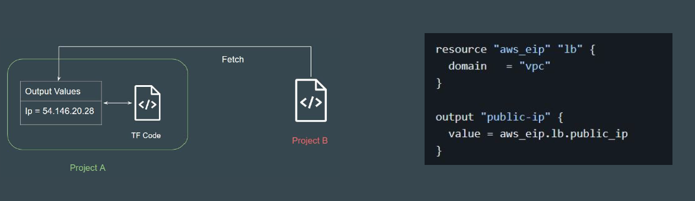
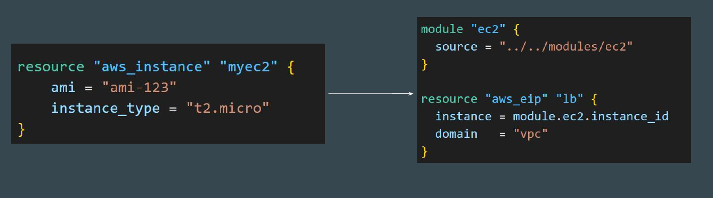
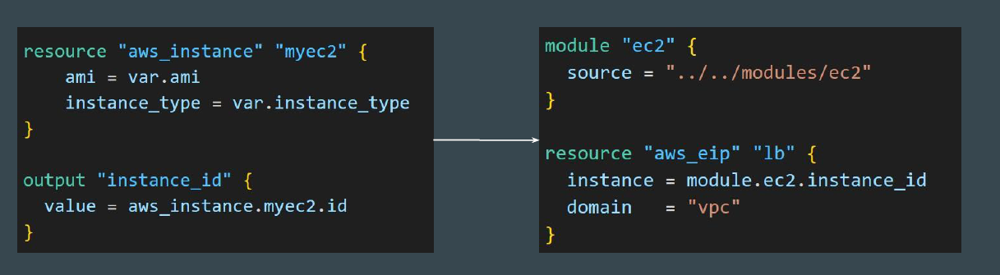

# Module Outputs

## Revising Output Values

Output values make information about your infrastructure available on the
command line, and can expose information for other Terraform configurations to
use.

## Understanding the Challenge

If you want to create a resource that has a dependency on an infrastructure
created through a module, you won’t be able to implicitly call it without output
values.

## Accessing Child Module Outputs

Ensure to include output values in the module code for better flexibility and
integration with other resources and projects.
Format: module.<MODULE NAME>.<OUTPUT NAME>

