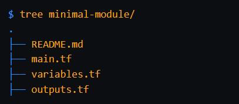
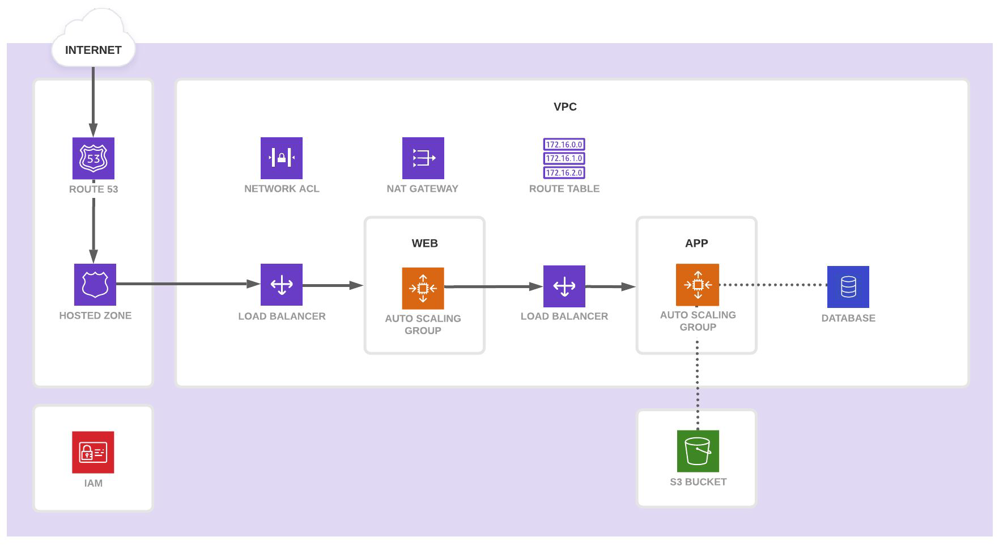
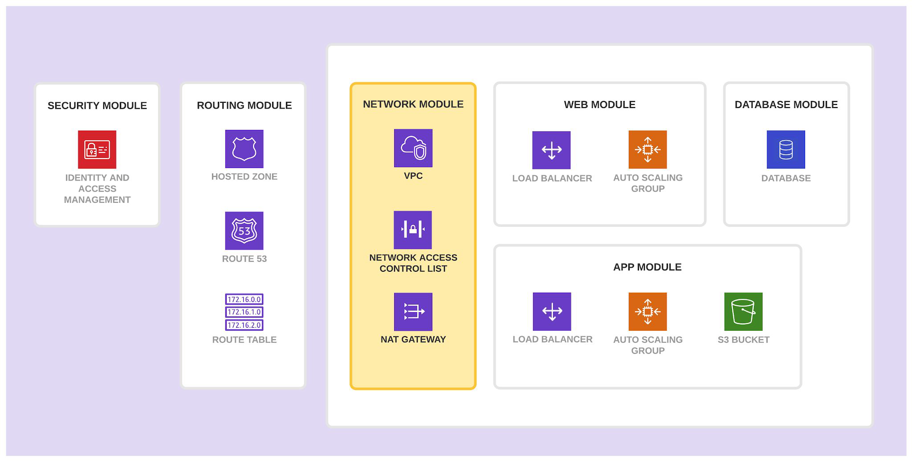

# Standard Module Structure

At this stage, we have been keeping the overall module structure very simple to
understand the concepts.
In production environments, it is important to follow recommendations and
best-practices set by HashiCorp.

The standard module structure is a file and directory layout HashiCorp
recommends for reusable modules.
A minimal recommended module following the standard structure is shown
below;

## Scope the Requirements for Module Creation

A team wants to provision their infrastructure using Terraform.
The following architecture diagram depicts the desired outcome.

## Planning a Module Structure

In this scenario, a team of Terraform producers, who write Terraform code from
scratch, will build a collection of modules to provision the infrastructure and
applications.
The members of the team in charge of the application will consume these
modules to provision the infrastructure they need.

## Final Module Output

After reviewing the consumer team's requirements, the producer team has
broken up the application infrastructure into the following modules:
Network, Web, App, Database, Routing, and Security.

