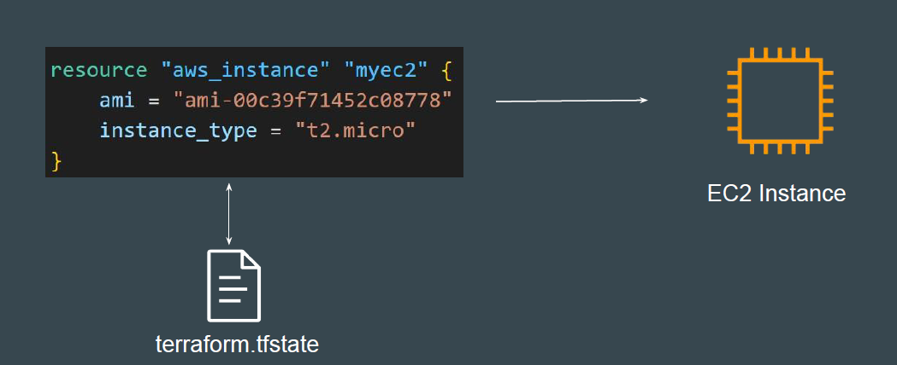
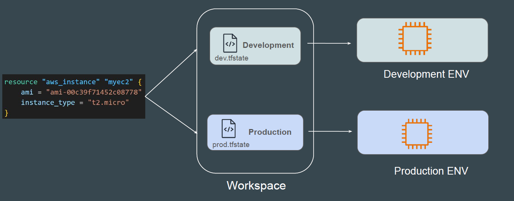
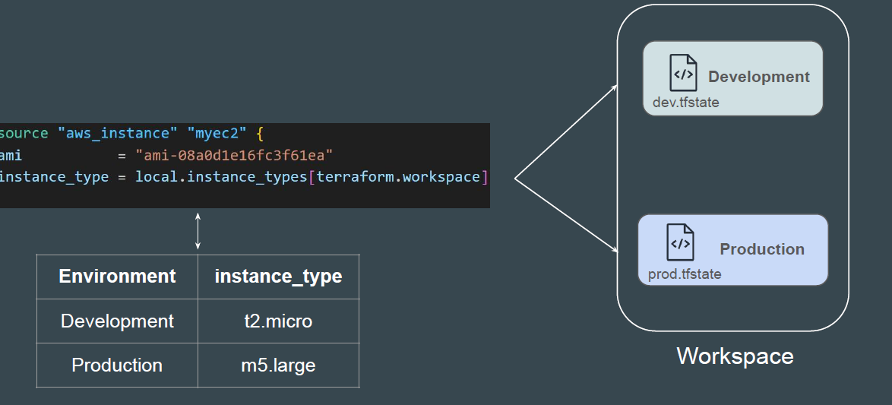

# Terraform Workspace

An infrastructure created through Terraform is tied to the underlying Terraform
configuration and a state file.



What if we have multiple state file for single Terraform configuration?
Can we manage different env’s through it separately?


## Introducing Terraform Workspace

Terraform workspaces enable us to manage multiple set of deployments from
the same sets of configuration file.



## Flexibility with Workspace

Depending on the workspace being used, the value to a specific argument in
your Terraform code can also change.



## Terraform Workspace commands:

```
terraform workspace
terraform workspace show
terraform workspace new dev
terraform workspace new prod
terraform workspace list
terraform workspace select dev

```