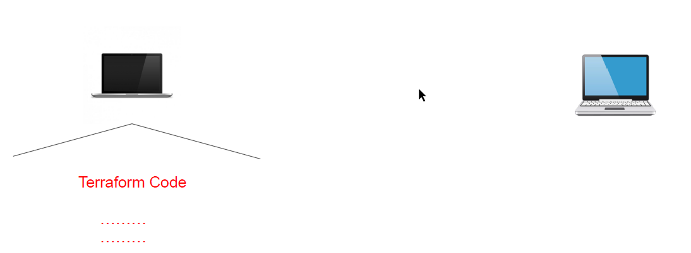
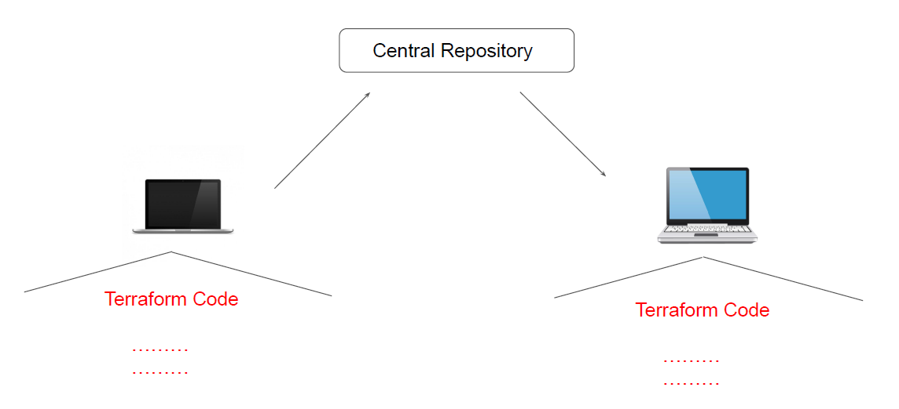
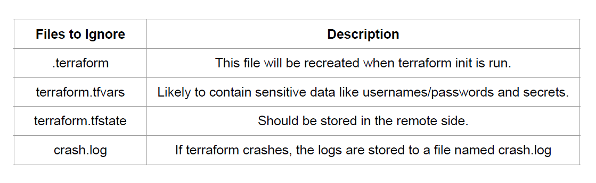

# Team Collaboration

Currently we have been working with terraform code locally.

## Centralized Management

## Terraform & GitIgnore

The .gitignore file is a text file that tells Git which files or folders to ignore in a project.
Depending on the environments, it is recommended to avoid committing certain files to GIT.

