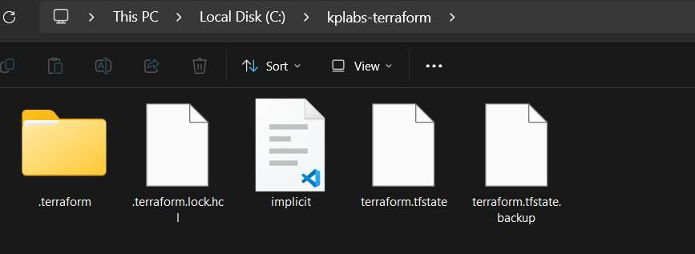
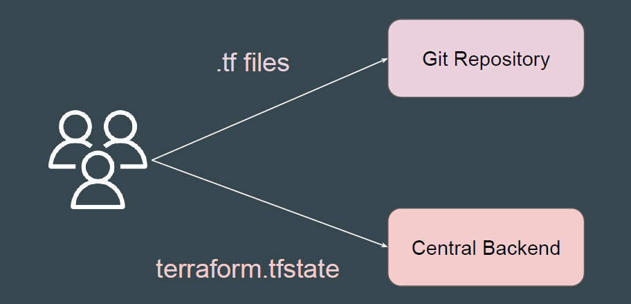
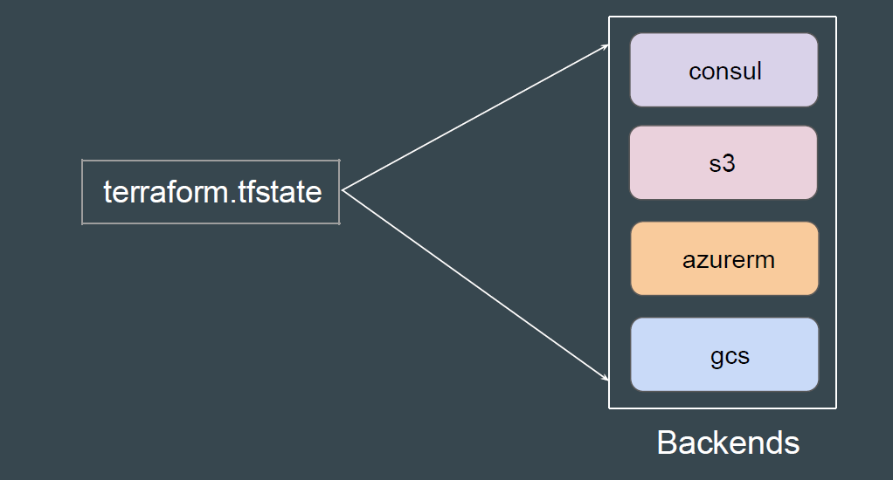
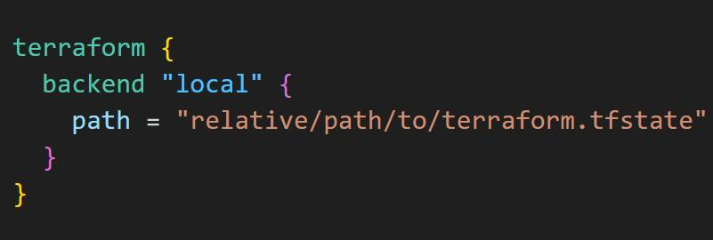
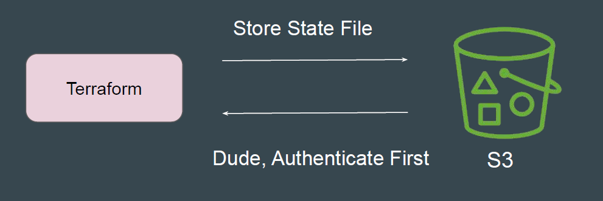

# Terraform Backends

Backends primarily determine where Terraform stores its state file.
When you do not specify a backend block in your Terraform configuration,
Terraform uses the default local backend that stores terraform.tfstate in the
same project folder.

## Challenges with Local Backend

Nowadays, Terraform projects are often handled collaboratively by entire teams.
Storing the state file locally (e.g., on a developer's laptop) hinders effective team
collaboration.

## Recommended Architecture

1. The Terraform Code is stored in a Git Repository.
2. The State file is stored in a Central backend.

## Supported Backends in Terraform

Terraform supports wide variety of remote backends to store state file
information.

## Explicit Local Backend Configuration

The local backend stores state on the local filesystem, locks that state using
system APIs, and performs operations locally.

## Important Note - Remote Backends

Accessing state in a remote service generally requires some kind of access
credentials
Some backends act like plain "remote disks" for state files; others support state
locking functionality.

