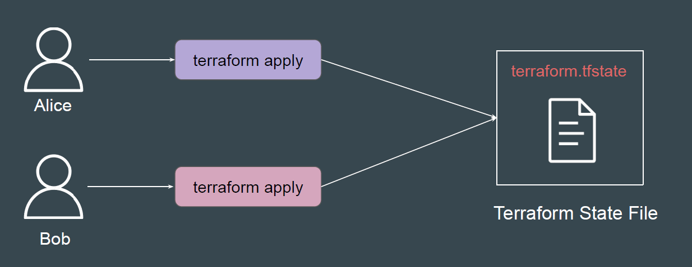
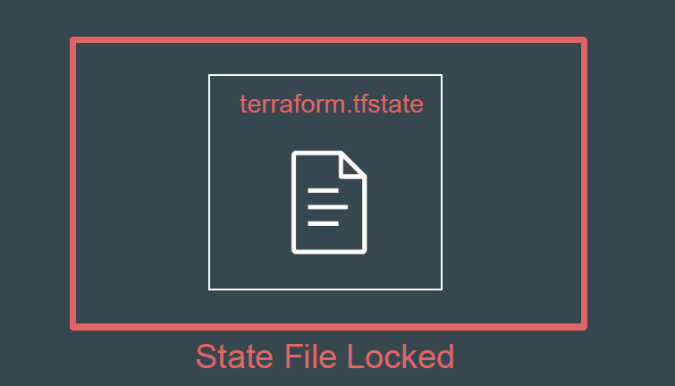
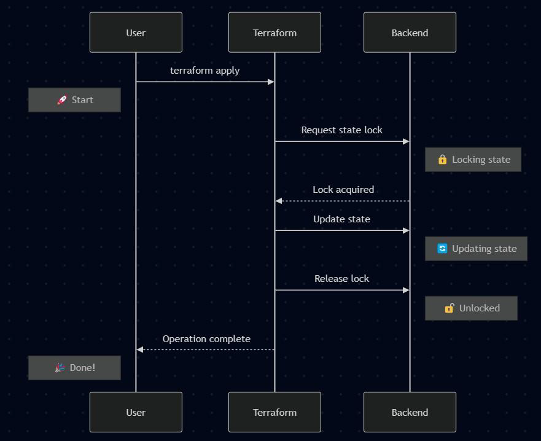
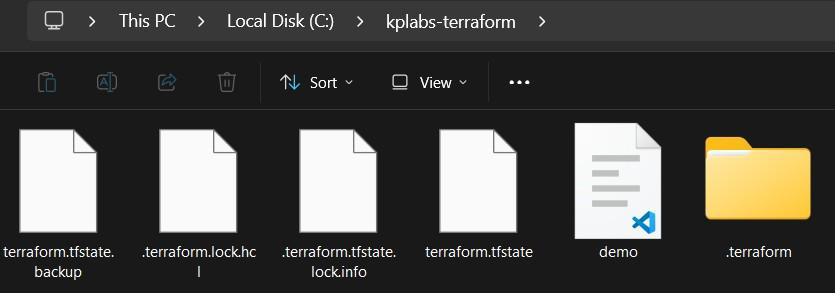

# State Locking

Running "terraform apply" simultaneously by multiple team members on same
project can cause Terraform to make concurrent changes to the state file. This
can result in state file corruption and inconsistencies.

## Introducing State Locking

State locking is a mechanism that prevents multiple operations from making
concurrent changes to your infrastructure state file, which could lead to
corruption or inconsistent state.

- Before performing any write operation, Terraform attempts to acquire a
  "lock" on the state file.
- If the lock is successfully acquired, Terraform proceeds with the operation.
- Once the operation is complete , Terraform releases the lock, allowing other
  processes to acquire it.

## State Locking with Local Backend

If using local state (local backend), Terraform uses a .lock file in the working
directory for locking.

## What Happens if state file is Locked?

When a state lock is held, any attempt by another process to operate will fail
with an error.

