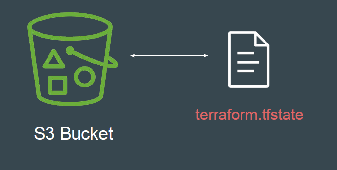
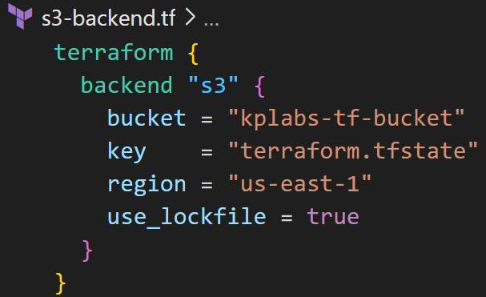

# S3 Backend

The S3 backend allows Terraform to store state file in a specific S3 bucket.

Note: Terraform should have required access to the S3 Bucket to be able to
push and pull state file to/from S3 bucket.

## Additional Recommendation - Bucket Versioning

It is highly recommended that you enable Bucket Versioning on the S3 bucket to
allow for state recovery in the case of accidental deletions and human error.