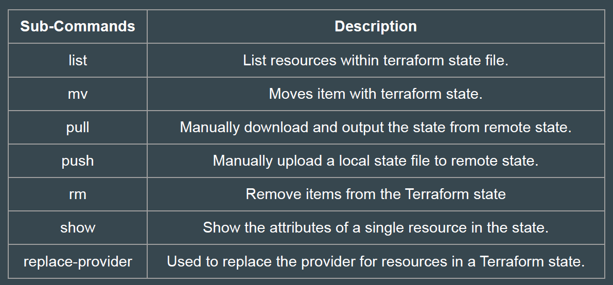
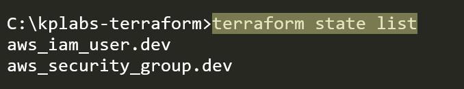
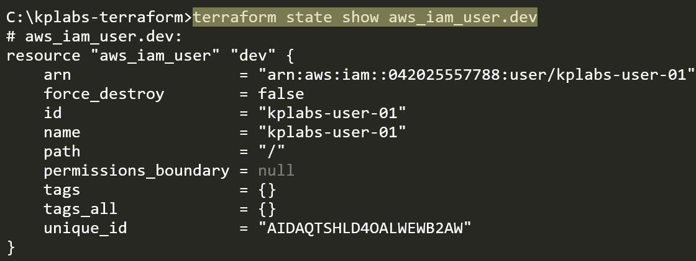
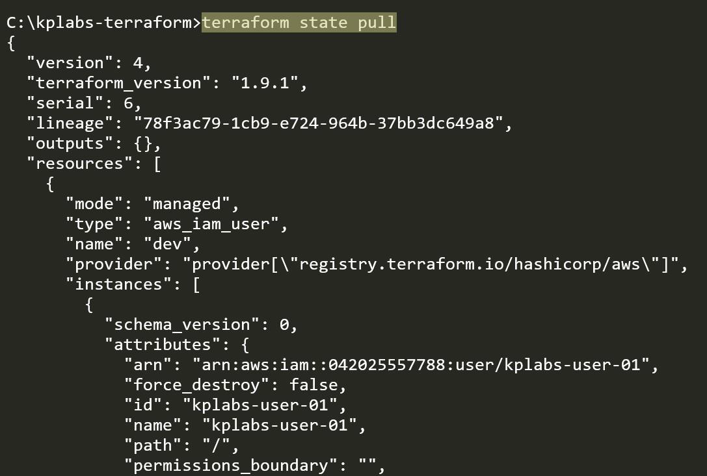
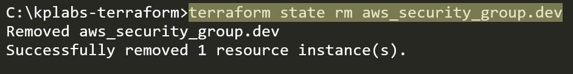
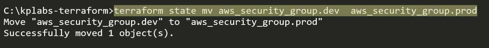
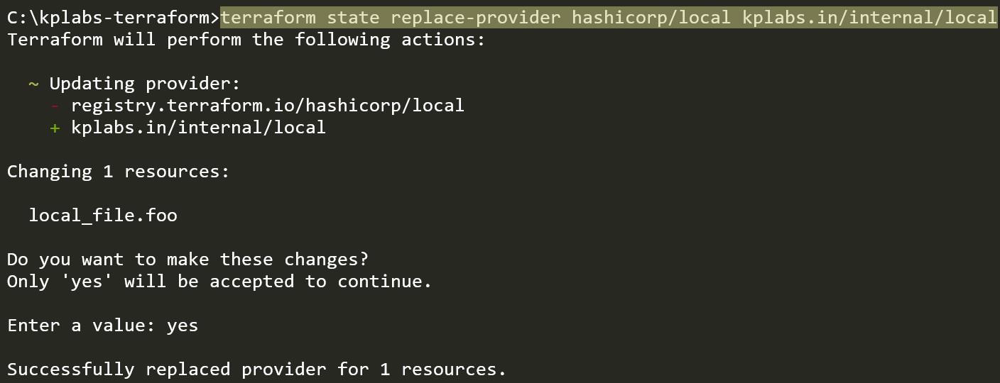

# Terraform State Management

As your Terraform usage becomes more advanced, there are some cases where
you may need to modify the Terraform state.
It is NOT recommended to modify the state file manually.

## State Management

The terraform state command is used for advanced state management.

### Sub-Command 1 - List

The terraform state list command is used to list resources within a Terraform
state.
Useful if you want to quickly view all resources managed by Terraform.

### Sub-Command 2 - Show

The terraform state show command is used to show the attributes of a single
resource in the state.
Useful for debugging and understanding the current attributes of a resource.

### Sub-Command 3 - pull

The terraform state pull command is used to pull the state from a remote
backend and output it to stdout.
Useful to view or backup the current state stored in a remote backend.

### Sub-Command 4 - rm

The terraform state rm command is used to remove items from the state.
Use this when you need to remove a resource from Terraform’s state
management without destroying it.

### Sub-Command 5 - mv

The terraform state mv command is used to move an item in the state to a
different address.

### Sub-Command 6 - replace-provider

The terraform state replace-provider command is used to replace the provider
for resources in a Terraform state.

