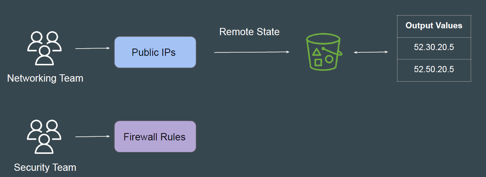
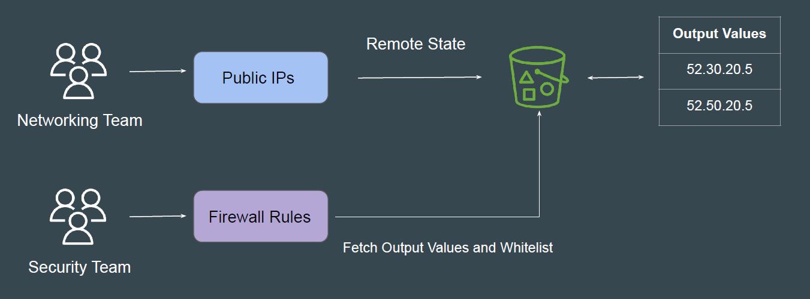
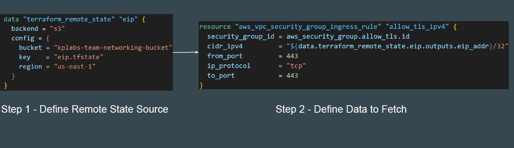

# Remote State Data Source

In larger enterprises, there can be multiple different teams working on different
aspects of a infrastructure resource.

Security Team wants that all the IP addresses added as part of Output Values in
tfstate file of Networking Team project should be whitelisted in Firewall.

## What Needs to be Achieved

- The code from Security Team project should connect to the terraform.tfstate
  file managed by the Networking team.

- The code should fetch all the IP addresses mentioned in the output values
  in the state file.

- The code should whitelist these IP addresses in Firewall rules.

## Practical Workflow Steps

- Create two folders for networking-team and security-team
- Create Elastic IP resource in Networking Team and Store the State file in S3
  bucket. Output values should have information of EIP.
- In Security Team, use Terraform Remote State data source to connect to the
  tfstate file of Networking Team.
- Use the Remote State to fetch EIP and whitelist it in Security Group rule.

## Introducing Remote State Data Source

The terraform_remote_state data source allows us to fetch output values from a
specific state backend

