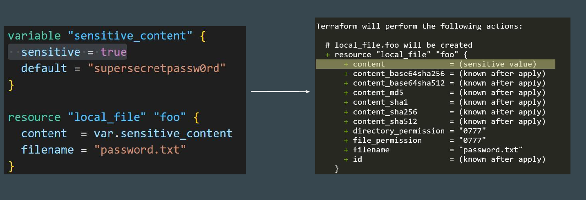
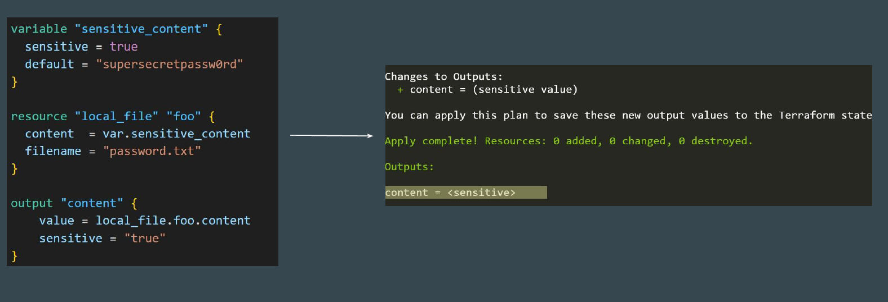
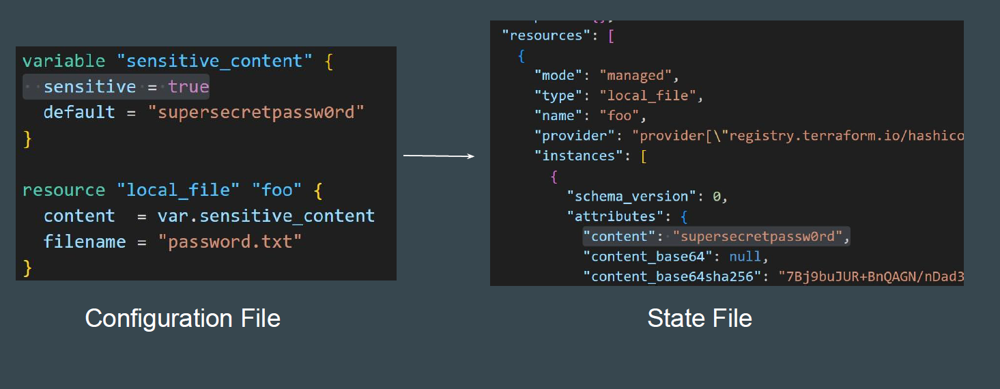

# Sensitive Parameter

By default, Terraform will show the values associated with defined attributes in
the CLI output during plan, apply operations for most of the resources.

We should design our Terraform code in such way that no sensitive information
is available and shown out of the box in CLI Output, Logs, etc.

# Basics of Sensitive Parameter

Adding sensitive parameter ensures that you do not accidentally expose this
data in CLI output, log output

# Sensitive Values AND Output Values

If you try to reference sensitive value in output values, Terraform will immediately
give you an error.

If you still want sensitive content to be available in “output” of state file but
should not be visible in CLI Output, Logs, following approach can be used.

# Important Point to Note

Sensitive parameter will NOT protect / redact information from State file.

# Benefits of Mature Providers

Various providers like AWS will automatically considers the password argument
for any database instance as sensitive and will redact it as a sensitive value

# Documentation Referenced:

https://registry.terraform.io/providers/hashicorp/local/latest/docs/resources/file

https://registry.terraform.io/providers/hashicorp/local/latest/docs/resources/sensitive_file

https://registry.terraform.io/providers/hashicorp/aws/latest/docs/resources/db_instance