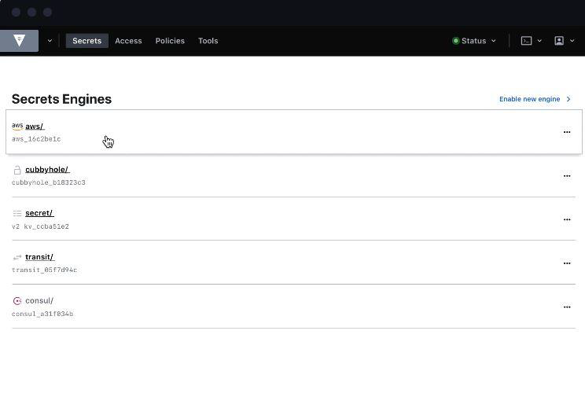
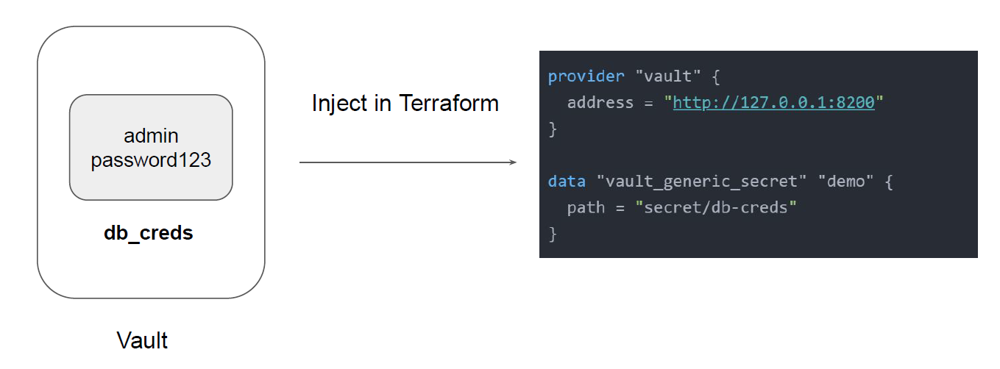

# Overview of Vault

HashiCorp Vault allows organizations to securely store secrets like tokens, passwords, certificates
along with access management for protecting secrets.
One of the common challenges nowadays in an organization is “Secrets Management”
Secrets can include, database passwords, AWS access/secret keys, API Tokens, encryption keys
and others.

Once Vault is integrated with multiple backends, your life will become much easier and you can
focus more on the right work.
Major aspect related to Access Management can be taken over by vault.

# Vault Provider

The Vault provider allows Terraform to read from, write to, and configure HashiCorp
Vault.

# Important Note

Interacting with Vault from Terraform causes any secrets that you read and write to be
persisted in both Terraform's state file.

