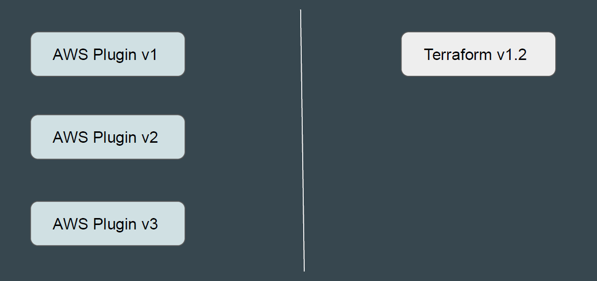
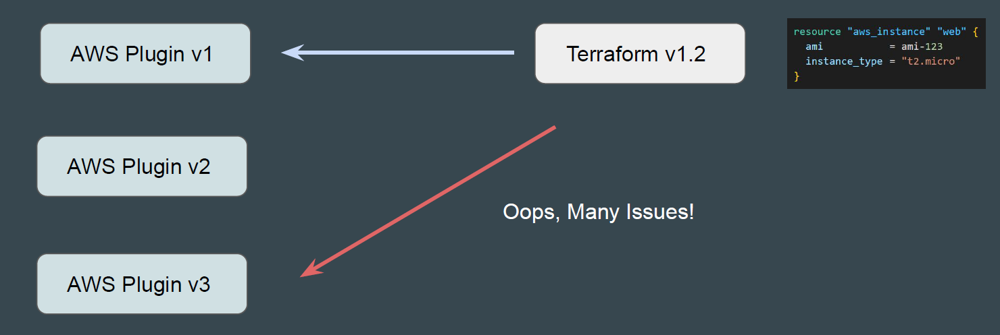
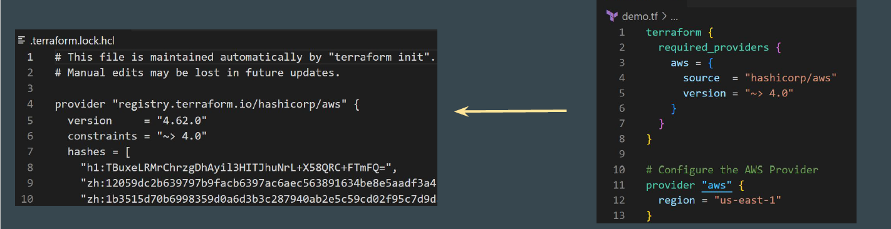
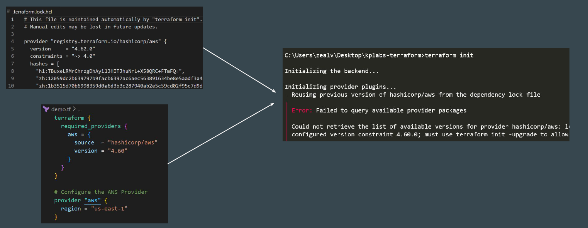
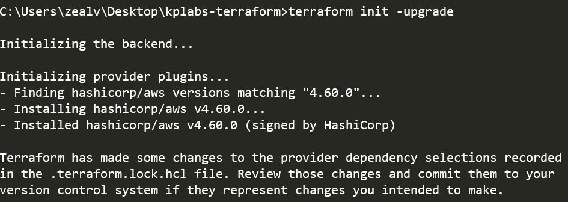
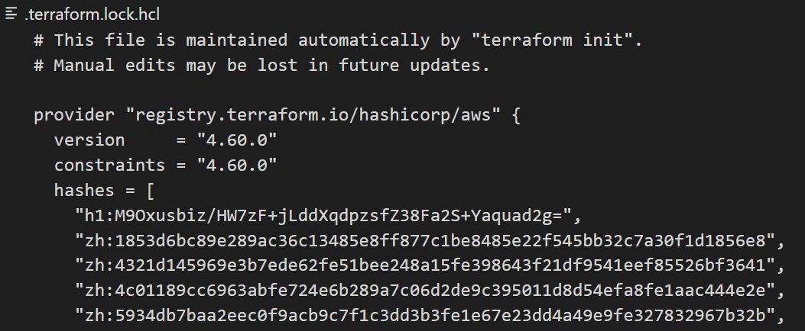

# Dependency Lock File

Provider Plugins and Terraform are managed independently and have different
release cycle.

# Understanding the Challenge

The AWS code written in Terraform is working perfectly well with AWS Plugin v1
It can happen that same code might have some issues with newer AWS plugins.

# Version Dependencies

Version constraints within the configuration itself determine which versions of
dependencies are potentially compatible.
After selecting a specific version of each dependency Terraform remembers the
decisions it made in a dependency lock file so that it can (by default) make the
same decisions again in future.

# Default Behaviour

What happens if you update the TF file with version that does not match the
terraform.lock.hcl?

# Upgrading Option

If there is a requirement to use newer or downgrade a provider, can override that
behavior by adding the -upgrade option when you run terraform init, in which
case Terraform will disregard the existing selections

# Points to Note

When installing a particular provider for the first time, Terraform will pre-populate
the hashes value with any checksums that are covered by the provider
developer's cryptographic signature, which usually covers all of the available
packages for that provider version across all supported platforms.

At present, the dependency lock file tracks only provider dependencies.
Terraform does not remember version selections for remote modules, and so
Terraform will always select the newest available module version that meets the
specified version constraints.