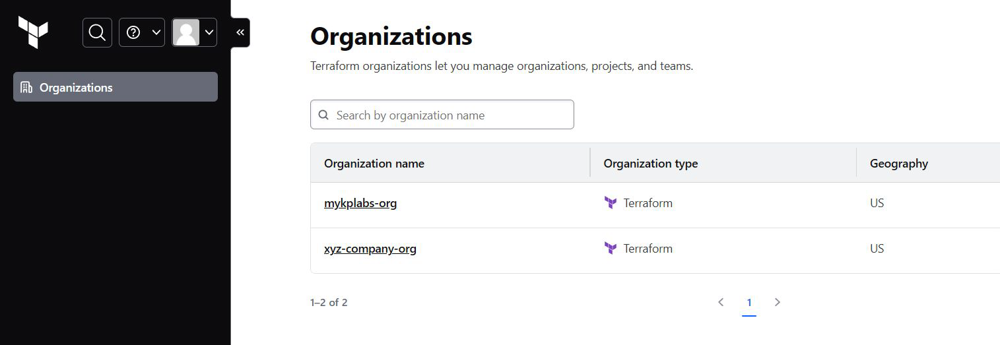
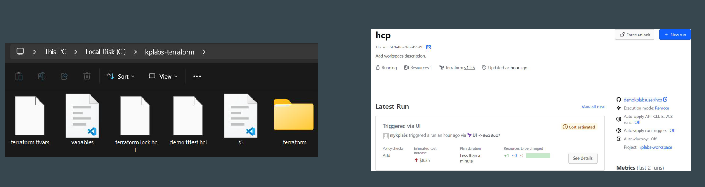
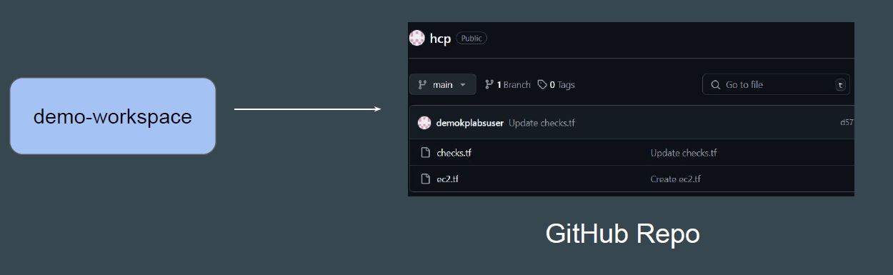
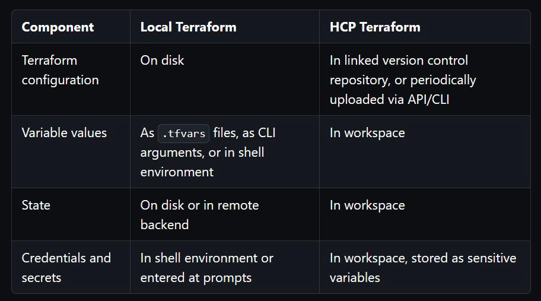
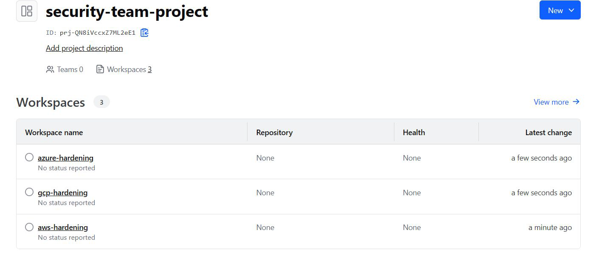

# HCP Terraform - Basic Structure

Organizations are a shared space for one or more teams to collaborate on
workspaces.

HCP Terraform manages plans and billing at the organization level.
Each HCP Terraform user can belong to multiple organizations, which might
subscribe to different billing plans.

# Workspace

HCP Terraform manages infrastructure collections with workspaces instead of
directories

The Terraform configuration file (sample.tf) is not directly uploaded to a
workspace.
Instead, workspace is connected to GitHub repository where it can fetch code
from.

  

# Projects

HCP Terraform projects let you organize your workspaces into groups.

You can structure your projects based on your organization's resource usage
and ownership patterns, such as teams, business units, or services.
With HCP Terraform Standard Edition, you can give teams access to groups of
workspaces using projects.