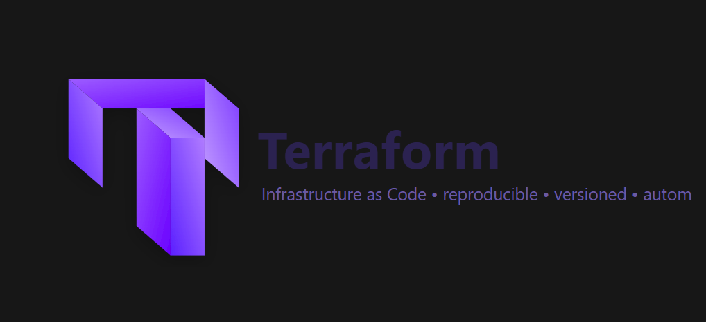

# Terraform Repository

Welcome to the Terraform repository! This repository contains infrastructure as code (IaC) configurations using Terraform to provision and manage cloud resources efficiently and securely.

## 📌 What this repo contains

---

## 🔎 Why Terraform?

- **Declarative IaC**: describe *what* you want; Terraform handles the *how*.
- **Provider ecosystem**: AWS, Azure, GCP, Kubernetes, GitHub, and more.
- **Safe changes**: plans show diffs before changes are applied.
- **Versioned infra**: review infra changes via pull requests like app code.
- **Composable modules**: DRY patterns for consistent environments.

---

---

# Course-Document Mapper

| Sr No | Document Link |
| ------ | ------ |
| 1 | [Chapter1-Understand the basics of Terraform][PlDa] |
| 2 | [Chapter2- Deploy Infrastructure with Terreform][PlDb] |
| 3 | [Chapter3- Terraform Provisioners][PlDc] |
| 4 | [Chapter4- Terraform Modules & Workspaces][PlDd] |
| 5 | [Chapter5- Remote State Management][PlDe] |
| 6 | [Terraform Provider Versioning][PlDf] |
| 7 | [Chapter6- Security Primer][PlDg] |
| 8 | [Chapter7- Terraform Cloud Enterprise][PlDh] |

   [PlDa]: <./Chapter1-Understand the basics of Terraform/>
   [PlDb]: <./resource-providers.md>   
   [PlDc]: <./provider-tiers.md>
   [PlDd]: <./github.md>
   [PlDe]: <./destroy.md>   
   [PlDf]: <./provider-versioning.md>
   [PlDg]: <./refresh.tf>
   [PlDh]: <./aws-provider-auth.md>
   
